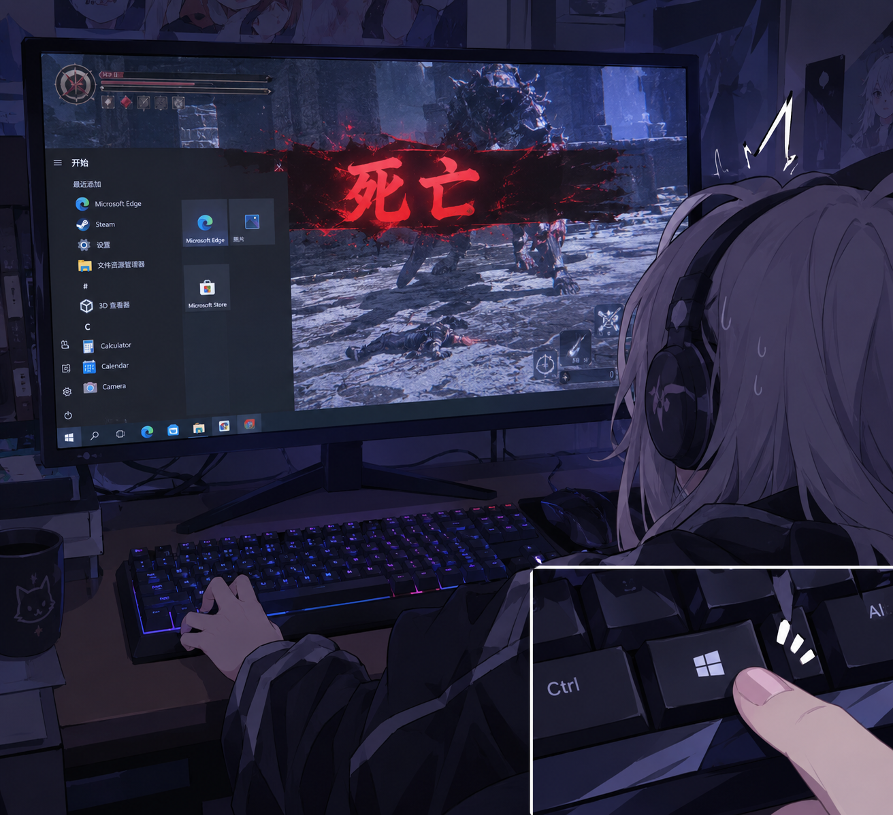

# 防win杜win

> 防微杜渐（fáng wēi dù jiàn）——把坏事扼杀在萌芽时。
> 防win杜win：把「微」「渐」换成 win，意思一点没变——
> 把 Win 键误触这档子破事，扼杀在摇篮里。
>
> *STOP win from WIN!*

[English](#english)

---

「开始菜单弹出来的那一刻，我的操作也死了。」

深夜，Boss 残血，走位完美，就差最后一刀——
左手一滑，Win 键按了下去。
开始菜单盖住半屏，角色倒在怪物脚下。
你盯着屏幕，红温，血压拉满，大脑一片空白。
想骂人，骂不出来；想重开，手都懒得动。

这不怪手残，怪键盘：`ctrl - win - alt - space - alt - fn - 菜单`，
Win 键就大大咧咧躺在 Ctrl 和 Alt 中间，随时准备背刺你。

## 它做了什么

| 按键 | 下场 |
|---|---|
| 左 Win | 直接退役——按了等于没按，游戏里随便滚键盘 |
| 菜单键 | 废物复活，成为右 Win——有菜单键的键盘，它基本都在吃灰 |
| 右 Alt | 顶替上岗，成为新 Win——大部分键盘都有，为没有菜单键的键盘补上 Win |

## 安装

1. 下载 `通用键盘布局.reg`（最新版在 [Releases](releases) 页）
2. 右键 → 合并（或双击），提示时选「是」——需要管理员权限
3. 重启电脑，生效

## 还原

1. 下载 `键盘布局恢复.reg`，双击导入
2. 重启
3. 或者：regedit 打开 `HKEY_LOCAL_MACHINE\SYSTEM\CurrentControlSet\Control\Keyboard Layout`，删掉 `Scancode Map` 这个值，重启

## 为什么是注册表方案

- **系统级**：登录界面、UAC 弹窗都生效，开机即读，不存在加载失败
- **零后台**：没有进程、没有常驻内存，杀都杀不掉（没东西可杀）
- **反作弊友好**：没有 AHK 那种可能被反作弊误判的后台按键工具
- **免安装**：不需要任何第三方软件，双击导入，重启即用
- **可逆**：恢复 reg 一键还原，蛋都不剩
- 支持 Windows 7 / 8 / 10 / 11（应该，因为我只在 10 和 11 上用过）

## 注意事项

- **AltGr 警告**：德语、法语、西班牙语等国际布局用右 Alt 打 `@` `\` `€`——需要 AltGr 的话别导入，或只保留菜单键映射
- 对 RDP 远程桌面会话不生效（映射在本地键盘层完成）
- Fn 键是硬件层的，任何软件都动不了它
- 紧凑键盘（65%/75%）没有菜单键，只剩右 Alt 一个 Win 位

## 有别的方案吗

PowerToys Keyboard Manager、AutoHotkey 也能改键，但是应用层：要常驻后台、可能被反作弊误判、登录界面不生效。本方案是系统层，一劳永逸。代价是：改完要重启，全局生效，不能按应用区分。

## 许可

🥚 [LICENSE](LICENSE)

---

> 此发布为我的AI打印机所为，但是注册表文件是我自己写的。

---

## STOP win from WIN!

> 防微杜渐 (fáng wēi dù jiàn) — a classical Chinese idiom: "nip problems in the bud".
> 防win杜win swaps 微 (wēi) and 渐 (jiàn) for "win" — the meaning survives:
> nip Win-key mishaps in the bud, before they cost you the game.

---

"The moment the Start menu pops up, my run is over."

Late night. The boss at 1 HP, positioning perfect, one hit away from victory —
your left hand slips, and you press the Win key.
The Start menu covers half the screen. Your character falls at the monster's feet.
You stare at the screen, fuming, blood pressure maxed, mind blank.
You want to scream — nothing comes out. You want to retry — your hands won't move.

It's not your fault. It's the keyboard: `ctrl - win - alt - space - alt - fn - menu`.
The Win key sits right between Ctrl and Alt, waiting to backstab you.

## What it does

| Key | Fate |
|---|---|
| Left Win | Retired. Pressing it does nothing — mash away mid-fight |
| Menu key | Resurrected as Right Win — on keyboards that have it, it's usually gathering dust |
| Right Alt | Promoted to Left Win — almost every keyboard has one, so even without a Menu key you still get a Win key |

## Install

1. Download `通用键盘布局.reg` (latest in [Releases](releases))
2. Right-click → Merge (or double-click), confirm "Yes" — admin rights required
3. Restart your computer

## Restore

1. Download `键盘布局恢复.reg`, double-click to import
2. Restart
3. Or: regedit → `HKEY_LOCAL_MACHINE\SYSTEM\CurrentControlSet\Control\Keyboard Layout` → delete the `Scancode Map` value → restart

## Why registry

- **System-level**: applies at the login screen and UAC prompts; read at boot, cannot fail to load
- **Zero background**: no process, no resident memory — there is nothing to kill
- **Anti-cheat friendly**: unlike AutoHotkey-style tools, there is no background process for anti-cheat to flag
- **No software needed**: nothing to install, double-click a .reg and reboot
- **Reversible**: one restore .reg brings everything back
- Works on Windows 7 / 8 / 10 / 11 (should — only tested on 10 and 11)

## Caveats

- **AltGr warning**: German, French, Spanish and other international layouts use Right Alt (AltGr) to type `@` `\` `€` — if you need AltGr, don't import this, or keep only the Menu key mapping
- Does not apply to RDP sessions (mapping happens at the local keyboard layer)
- Fn is hardware-level; no software can remap it
- Compact keyboards (65%/75%) have no Menu key — but you still get one Win key from Right Alt

## Alternatives?

PowerToys Keyboard Manager and AutoHotkey can remap keys too, but they work at the app layer: a resident background process, possible anti-cheat false positives, and no effect at the login screen. This is system-level, set-and-forget. Trade-offs: reboot required, global scope (can't limit to specific apps).

## License

🥚 [LICENSE](LICENSE)

---

> This release was made by my AI printer; the registry files, however, were written by me.
